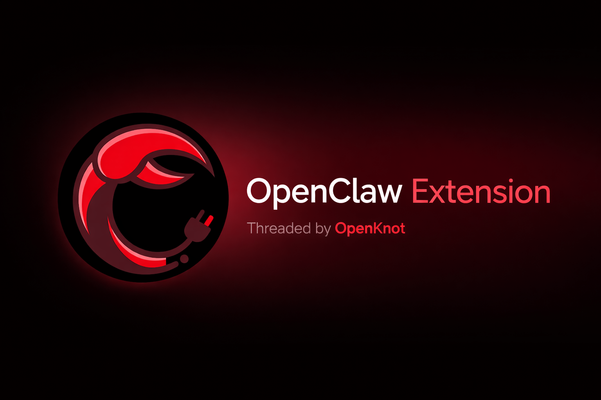
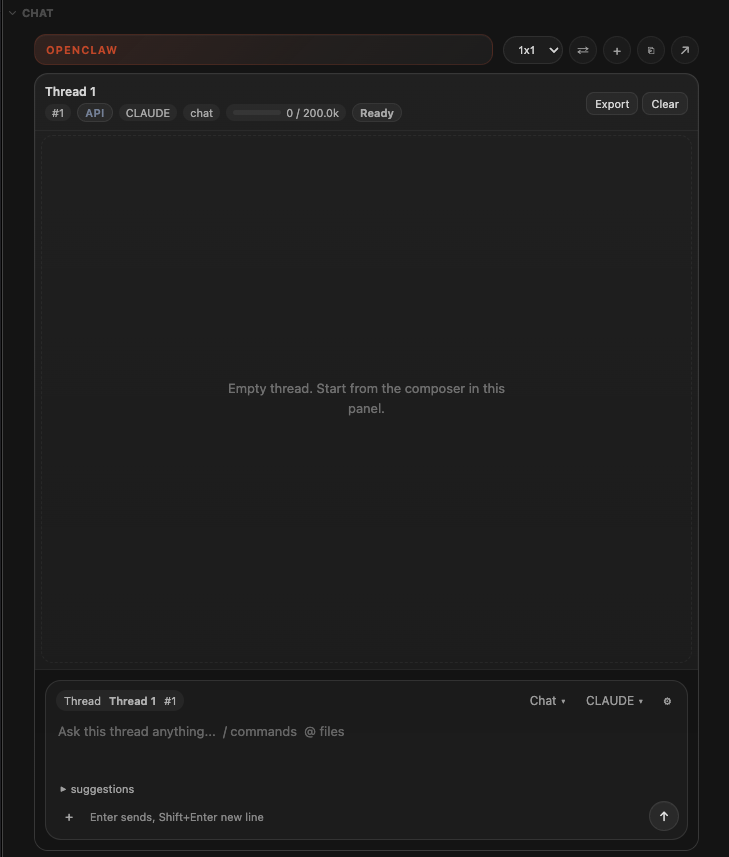
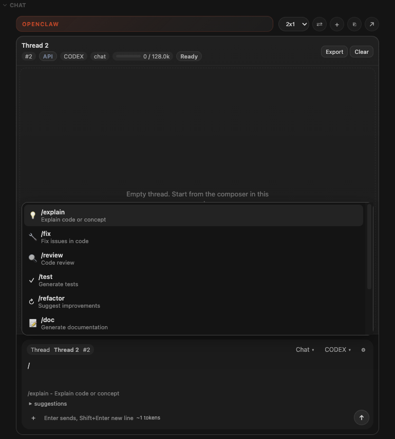
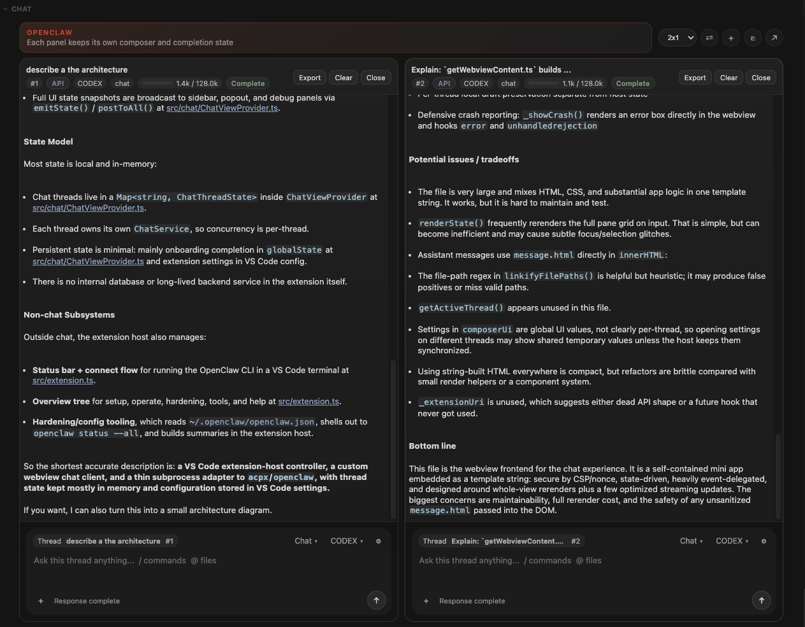

# Claw Code

A VS Code companion for [OpenClaw](https://docs.openclaw.ai). Chat with the agents on your OpenClaw Gateway from the editor, with your code as context, and manage, set up and harden OpenClaw from the sidebar.

> **Pre-release.** Claw Code is not yet published to the VS Code Marketplace or Open VSX. Install it from source (see [Install](#install)). Plans and status: [docs/roadmap.md](docs/roadmap.md).

## Features

### Chat with Gateway agents

- **Gateway transport.** Connects straight to the OpenClaw Gateway over WebSocket, reconnects with backoff, and catches up on missed messages after a reconnect or a window restart. When the Gateway is unreachable it can fall back to the local `acpx` CLI.
- **Agent and session picker.** Choose an agent's session; every message goes to it, and an indicator shows when a run is already active.
- **History and resume.** Reopen earlier sessions and keep going where you left off.
- **Streaming replies** with tool calls grouped into collapsible steps. A setting hides finished groups.
- **Stop** a running reply at any time.
- **Several threads at once** in a grid (`1x1` up to `4x4`), each with its own composer and status, or popped out into an editor tab.
- **Usage gauge** showing tokens used against the model's context window.
- **Export** a conversation to Markdown or JSON.



### Editor context

- **`@`-mentions** to attach workspace files, including line ranges such as `@src/app.ts#L5-10`.
- **Insert selection** as a mention with `Alt+K` (`Cmd+Alt+K` on macOS).
- **Attach the open file** automatically to every normal message (`openclaw.chat.attachOpenFile`). Slash commands add their own context instead (see the table below).
- **Attachments** via the `+` button or drag and drop, including images.
- **Slash commands** that add the right context for the task:

| Command | Purpose | Context added |
| --- | --- | --- |
| `/explain` | Explain code or a concept | Selection or file |
| `/fix` | Find and fix problems | Diagnostics and code |
| `/review` | Review changes | Git diff |
| `/test` | Write tests | Selection or file |
| `/refactor` | Suggest improvements | Selection or file |
| `/doc` | Write documentation | Selection or file |
| `/commit` | Draft a commit message | Staged changes |
| `/harden` | Security review | File contents |
| `/plan` | Plan the work before changing anything | None (your task) |
| `/compact` | Summarise the conversation so far | The transcript |
| `/search` | Search the codebase | Your query |



### OpenClaw tools

- **Overview** in the activity bar: getting started, operations (status, doctor, update, dashboard, config), hardening, installed tools (enable, disable, uninstall) and help.
- **Security hardening**: run `openclaw security audit`, with fix and deep scans, and get a plain-language **access summary** of MCP servers, tools, key sources, endpoints and local files.
- **Guided setup** and a **model setup wizard** when the OpenClaw CLI is missing or not configured yet.
- **Status bar** connection indicator with one-click connect.



## Requirements

- VS Code **1.105** or newer.
- A chat backend — either or both of:
  - an **OpenClaw Gateway** you can reach — on this machine, on a server or NAS, or in Docker — and its token (the primary path; see the [OpenClaw docs](https://docs.openclaw.ai), `openclaw onboard --install-daemon`);
  - [`acpx`](https://www.npmjs.com/package/acpx) on your `PATH`, for the local CLI transport. With `openclaw.gateway.transport` set to `acpx` no Gateway is needed; with `auto` (the default) acpx is the fallback when the Gateway is unreachable.

## Install

Until the first Marketplace / Open VSX release, build and install from source. You need **git**, **Node.js 24** (the version CI builds with) and **pnpm** (`corepack enable` provides it), and the `code` or `cursor` command on your `PATH`.

On Linux, macOS, or Windows with Git Bash or WSL:

```sh
git clone https://github.com/OlehPendrakovskyi/claw-code.git
cd claw-code
pnpm install
scripts/install-local.sh
```

The script compiles the extension, packages a `.vsix` and installs it into `cursor` or `code`, whichever is on your `PATH`. Then reload the window.

In PowerShell, or any shell without Bash, run the same steps by hand:

```sh
git clone https://github.com/OlehPendrakovskyi/claw-code.git
cd claw-code
pnpm install
pnpm run compile
pnpm dlx @vscode/vsce@4.0.0 package --no-dependencies -o claw-code.vsix
code --install-extension claw-code.vsix --force   # or: cursor --install-extension claw-code.vsix --force
```

## Connect to your Gateway

1. Set the Gateway address in **Settings → OpenClaw → Gateway: Url** (`openclaw.gateway.url`, default `ws://127.0.0.1:18789`).
2. Run **OpenClaw: Connect to Gateway** from the Command Palette and paste the Gateway token. It is stored in VS Code's SecretStorage, never in `settings.json`.
3. Open the **OpenClaw** view in the activity bar, pick an agent with **OpenClaw: Pick Agent Session**, and start chatting.

The first time, the Gateway may ask you to approve this device (pairing). Approve it on the Gateway, for example in the OpenClaw Control UI. **OpenClaw: Reset Gateway Device Identity** starts over with a new identity.

**Use `wss://` for anything that is not on this machine.** The token is sent when the connection opens, so plain `ws://` to a NAS or server sends it unencrypted over the network. Claw Code warns you when that happens. Use `wss://`, or a secure tunnel such as SSH port forwarding, Tailscale or WireGuard.

### Where your code lives

| Setup | Recommended approach |
| --- | --- |
| **The repository is on the Gateway host** (server, NAS, Docker) | Open it with VS Code **Remote** (SSH, WSL or Tunnel), so the editor and the agent see the same files. This is the best-supported setup |
| **The repository is on the Gateway host, but your window is local** | Chat works and the agent edits files on the Gateway host; the editor sees those changes only as text in the chat |
| **The agent cannot reach your code** | Attach files and selections to the prompt; apply the agent's patch yourself |

### Local CLI fallback

`openclaw.gateway.transport` decides the chat backend: `gateway`, `acpx` (local CLI), or `auto` (the default: the Gateway when reachable, otherwise acpx). With acpx, `openclaw.chat.agent` and `openclaw.chat.permissions` choose the agent and what it may do.

## Commands

| Command | Description |
| --- | --- |
| OpenClaw: Open Chat | Focus the chat view |
| OpenClaw: Pop Out Chat | Move the chat into an editor tab |
| OpenClaw: New Chat Session | Open a new blank thread in the panel. On the Gateway it uses the default session, so it continues that session's context; pick another session with **Pick Agent Session** for separate context |
| OpenClaw: Pick Agent Session | Choose the Gateway agent session to talk to |
| OpenClaw: Connect to Gateway | Save the Gateway token and connect |
| OpenClaw: Reset Gateway Device Identity | Forget this device's pairing and create a new identity |
| OpenClaw: Insert Selection Mention | Add the selection to the prompt (`Alt+K` / `Cmd+Alt+K`) |
| OpenClaw: Connect | Run the configured OpenClaw CLI command in a terminal |
| OpenClaw: Setup | Guided install of OpenClaw and its prerequisites |
| OpenClaw: Model Setup Wizard | Onboarding and model provider selection |
| OpenClaw: Harden | Run the security hardening workflow |
| OpenClaw: Hardening Access Summary | Show what OpenClaw can access |
| OpenClaw: Debug Chat Panel | Inspect chat events |

## Settings

| Setting | Default | Description |
| --- | --- | --- |
| `openclaw.gateway.url` | `ws://127.0.0.1:18789` | Gateway WebSocket URL |
| `openclaw.gateway.transport` | `auto` | `gateway`, `acpx`, or `auto` |
| `openclaw.gateway.protocolVersion` | `auto` | Gateway protocol version to offer; keep `auto` unless the Gateway reports a mismatch |
| `openclaw.chat.attachOpenFile` | `false` | Attach the active file to every normal message (not to slash commands) |
| `openclaw.chat.systemPrompt` | empty | Text added in front of every message |
| `openclaw.chat.dimension` | `1x1` | Thread grid: `1x1`, `2x2`, `2x3`, `3x3`, `4x4` |
| `openclaw.chat.collapseCompleted` | `true` | Collapse finished threads in the `1x1` view |
| `openclaw.chat.hideToolActivity` | `false` | Hide finished tool-call groups |
| `openclaw.chat.dynamicSubject` | `true` | Name threads from their content |
| `openclaw.chat.contextMax` | `0` | Context window size for the usage gauge (`0` = from the model name) |
| `openclaw.chat.source` | empty | Source label on each chat pane |
| `openclaw.chat.agent` | `codex` | Agent for the acpx fallback |
| `openclaw.chat.models` | `codex`, `claude`, `opencode` | Models offered in the composer picker |
| `openclaw.chat.permissions` | `approve-reads` | acpx permissions: `approve-reads`, `approve-all`, `deny-all` |
| `openclaw.command` | `openclaw status` | Command run by **OpenClaw: Connect** |
| `openclaw.autoConnect` | `false` | Run that command on startup |
| `openclaw.hardening.mode` | `full` | `full`, `audit`, or `auditFix` |
| `openclaw.hardening.command` | `openclaw` | Command prefix for hardening |
| `openclaw.dashboardUrl` | `http://127.0.0.1:18789/` | Dashboard opened from the Overview |

Settings that run commands, carry the token or change what the agent may do are user-level only: a workspace cannot set them.

**Windows with WSL:** set `openclaw.command` to `wsl openclaw status` and `openclaw.hardening.command` to `wsl openclaw`.

## Privacy

- No telemetry. On the Gateway transport, Claw Code talks only to the Gateway you configure.
- On the acpx fallback, your prompts and attached context go to whichever agent and model provider your local `acpx` is configured to use.
- The Gateway token and device identity live in VS Code's SecretStorage.

## Troubleshooting

| Problem | Try |
| --- | --- |
| Cannot connect to the Gateway | `openclaw gateway status`; check `openclaw.gateway.url`; re-run **OpenClaw: Connect to Gateway** |
| Connected, but runs wait for approval | Approve the device or the request in the OpenClaw Control UI |
| Protocol mismatch on connect | Update OpenClaw, or set `openclaw.gateway.protocolVersion` explicitly |
| `openclaw: command not found` | `npm install -g openclaw@latest`, restart VS Code, or run **OpenClaw: Setup** |
| `acpx not found` (fallback only) | `npm install -g acpx` |

Logs are in the **Output** panel under the OpenClaw channels.

## Development

Prerequisites: git, Node.js 24 and pnpm, as for [Install](#install).

```sh
pnpm install
pnpm run watch       # rebuild on change; press F5 to launch the Extension Development Host
```

Before pushing, run the same gates as CI, in its order: `pnpm run typecheck`, `pnpm run lint`, `pnpm run check:rules`, `pnpm run compile`, `pnpm run test:coverage`, `pnpm run license:check`. `test:coverage` applies the coverage thresholds in `vitest.config.ts`, as CI does. CI runs on Linux, Windows and macOS.

Project documents: [roadmap](docs/roadmap.md), [engineering foundation](docs/engineering.md), [development rules](docs/development-rules.md).

## Licence and acknowledgements

[MIT](LICENSE).

Claw Code began as a fork of [openknots/openclaw-extension](https://github.com/openknots/openclaw-extension) © OpenKnot AI / Val Alexander, and continues as an independent project. Many thanks for the original work.
